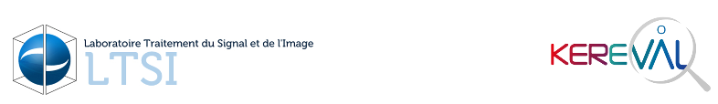

# Contexte

## Contexte métier du projet

Ce projet vise à développer un cadre d'interopérabilité autour des entrepôts de données de santé, notamment les données de chimiothérapie, en suivant le principe FAIR et en utilisant FHIR R5. Ces données seront exploitées à des fins secondaires telles que la recherche, la réalisation d'études de faisabilité ou bien encore l'amélioration de la qualité des soins.

## Contexte technique du projet

L'objectif de ce projet est de définir les spécifications de l’API REST (FHIR) pour interroger et alimenter l'entrepôt de données de santé qui recensera les données de chimiothérapie. 

Les ressources FHIR utilisées dans cet IG sont : Patient, Observation, Practitioner, Encounter, HealthcareService, Medication, DeviceDefinition, Careplan, MedicationRequest, MedicationAdministration.

# CI/CD

Les workflows associés à ce repository (.github/workflows) permettent :

* D'executer Sushi pour vérifier la grammaire
* De faire les tests avec le validator_cli
* De publier les pages : à venir

# Notes

Ce repository "IG-ONCOFAIR" a été créé à partir du repository [sample-ig](https://github.com/FHIR/sample-ig) de l'organisation GitHub FHIR.

Un commentaire ? Une remarque ? Utilisez les GitHub [issues](https://docs.github.com/fr/issues) pour indiquer vos propositions d'amélioration et de correction.

Lien vers la version en intégration continue : [https://oncofair.github.io/FHIR-ImplementationGuide-Article/main/ig/](https://oncofair.github.io/FHIR-ImplementationGuide-Article/main/ig/).
Pour prévisualiser une autre branche vous pouvez utiliser la syntaxe suivante : https://oncofair.github.io/FHIR-ImplementationGuide-Article/[NOM DE LA BRANCHE]/ig

## Acronymes

* IG : Implementation Guide
* FHIR : Fast Healthcare Interoperability Resources
* HL7 : Health Level Seven
* FAIR : Findable Accessible Interoperable Reusable

# Contacts
Si vous souhaitez contacter les équipes ayant travaillé sur ce projet :
* Pour les questions techniques : alain.ribault@kereval.com
* Pour les questions métier : marc.Cuggia@chu-rennes.fr
